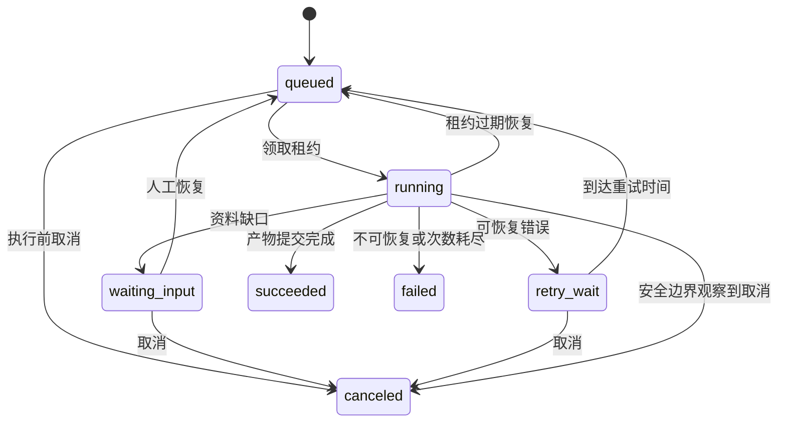

# 工程标书 AI Harness Agent 开发文档

> 版本：v1.0 ｜ 日期：2026-10-07 ｜ 状态：实施规范，尚未实现
>
> 上游：[开发方案.md](./开发方案.md)。接口和表结构分别见 [API文档.md](./API文档.md)、[数据库文档.md](./数据库文档.md)。

## 1. 实施目标与开发原则

从空仓库建立可本地运行、可公网演示的完整 Web 应用。先完成一条真实业务闭环，再扩展到重点章节；模拟供应商用于开发测试，不作为真实模型效果证明。

必须遵守的业务规则：

1. 组织从服务器会话确定，不接受用户指定租户上下文。
2. 项目事实必须来自确认数据，历史标书不能自动转为企业事实。
3. 发布的项目基准、文档文件和章节内容版本不可原地修改。
4. AI 候选版本不自动选用，不覆盖人工编辑。
5. 审查、审核与导出绑定具体基准和章节版本。
6. 不允许审核自己创建的版本；提交草稿必须通过严格导出校验。
7. 任务与模型调用可能重复，业务产物通过幂等实现去重。
8. 每个阶段的失败、等待和限制向用户清楚呈现。

## 2. 环境与仓库组织

### 2.1 建议兼容基线

| 依赖 | 基线 | 说明 |
|---|---|---|
| Python | 3.12 | API、Worker、文档处理；系统旧版本不作为项目解释器 |
| Node.js | 22 LTS | 前端开发和构建 |
| PostgreSQL | 17 + pgvector | 开发与测试必须使用真实 PostgreSQL |
| Redis | 7 | Celery Broker，启用持久化配置 |
| Docker | 支持 Compose v2 | 本地统一启动；Windows 使用 Linux 容器 |
| 浏览器 | 当前 Chrome / Edge | 主验收环境，保持基本响应式布局 |

首次实现时确定经过测试的依赖补丁版本，提交 Python 与 npm 锁文件。对 Docling 解析模型、中文字体和导出模板记录校验和，镜像使用固定版本和 digest。

### 2.2 目标目录

以下是待创建的实现结构，不代表当前已存在这些文件。

```text
backend/
  pyproject.toml
  app/
    main.py
    api/v1/                 # HTTP 路由、请求响应 DTO
    core/                   # 配置、鉴权依赖、事务、日志
    modules/
      identity/
      projects/
      documents/
      analysis/
      retrieval/
      chapters/
      harness/
      reviews/
      exports/
      operations/
    infrastructure/         # DB、S3、队列、模型、解析适配器
    workers/                # Celery、投递器、恢复巡检
    prompts/                # 已版本化的提示词模板
  migrations/
  tests/unit/
  tests/integration/
  tests/contracts/
frontend/
  src/app/
  src/pages/
  src/features/
  src/components/
  src/api/
  src/styles/
  tests/e2e/
deploy/
  compose.yaml
  nginx/
  monitoring/
scripts/                    # 初始化、备份、恢复、评测
evaluation/
  manifests/                # 样本清单，不包含未获准公开原件
  annotations/
  cases/
  reports/
docs/adr/
.github/workflows/
开发方案.md
开发文档.md
API文档.md
数据库文档.md
```

一个业务模块内按 domain、service、repository、schemas 组织。领域层不导入 HTTP、Celery 或供应商 SDK；应用服务掌握事务边界；repository 不隐式提交事务。

### 2.3 配置

| 配置 | 用途与规则 |
|---|---|
| APP_ENV | local / test / demo / production |
| DATABASE_URL | app_runtime 业务连接，启用 RLS |
| AUTH_DATABASE_URL | auth_service 连接，仅认证与账号表 |
| OPS_DATABASE_URL | 调度连接，仅 outbox；幂等表由业务连接在同事务中受权访问 |
| CHECKPOINT_DATABASE_URL | graph_runtime 连接，仅 Checkpointer schema |
| REDIS_URL | 内网 Broker |
| S3_ENDPOINT、S3_BUCKET、S3_ACCESS_KEY、S3_SECRET_KEY | 私有对象存储 |
| MODEL_MODE | simulated / cloud，禁止运行中静默降级 |
| MODEL_PROVIDER、MODEL_REGION、MODEL_API_KEY | 云端供应商、区域与密钥 |
| GENERATION_MODEL、EMBEDDING_MODEL | 可部署的具体模型标识 |
| EMBEDDING_DIMENSION | v1 固定 1024，与索引配置一致 |
| MODEL_PRICE_CONFIG | 版本化计价参数，cloud 模式必填；估算费用不等于账单 |
| SESSION_TTL_HOURS | 默认 12 小时 |
| CSRF_SIGNING_KEY | 派生会话关联 CSRF Token，轮换时撤销会话 |
| MAX_UPLOAD_BYTES、MAX_PDF_PAGES | 默认 50 MiB、400 页 |
| RUN_MAX_CALLS、RUN_MAX_TOKENS | 默认 12、60,000，可被更小的组织上限约束 |
| PROJECT_GENERATION_CONCURRENCY | 固定为 2 |
| PUBLIC_ORIGIN | 同源请求与 CSRF 校验 |
| OTEL_EXPORTER_OTLP_ENDPOINT | 内网追踪后端；关闭时保留结构化日志 |

提供无密钥的 .env.example；真实密钥不进仓库、API 响应和浏览器。演示数据由显式初始化命令建立，不在服务启动时无条件重置。

## 3. 业务模块实现

### 3.1 身份与组织

- 组织由运维初始化，关闭公开组织注册。
- 用户归属一个组织，邮箱在组织内唯一；角色为 admin、writer、reviewer。
- 密码使用 Argon2id；会话只保存随机 Token 的哈希。
- 登录接收组织 slug、邮箱和密码，失败统一提示，防止账号枚举。
- Cookie 采用 HttpOnly，生产开启 Secure，SameSite=Lax；写接口校验 Origin 和会话绑定 CSRF Token。
- 新账号首次登录必须修改临时密码；修改后撤销其他会话。
- 停用成员立即撤销其会话，并在后续 SSE 重连和心跳检查中生效。
- 避免停用或降级最后一个有效管理员。

鉴权分两步：认证仓储确认会话及账号，再在独立业务事务设置 org_id。认证连接不能读取业务内容，业务连接不能读取密码和会话秘密。

### 3.2 项目

项目包含名称、工程类型、描述、数据分类、状态、当前 baseline 与 lock_version。状态为 active、archived。

创建项目默认建立五个目录节点，不自动生成内容。用户可调整标题、顺序和父节点；节点必须在同项目内，不能形成环。

归档由管理员执行，需要项目没有非终态运行；归档项目只读，保留下载与历史查看。上传、编辑、生成、审核等写操作拒绝归档项目。

### 3.3 文档上传与解析

上传采用 API 中转，v1 不提供浏览器直传或公网对象 URL。

流程：

1. 流式读取文件，检查字节上限、扩展名与实际格式。
2. 保存到私有临时对象，计算 SHA-256。
3. 确认对象写入完成后，数据库事务登记文档版本、parse 运行和 outbox。
4. 数据库登记失败时保留可清理的临时对象，清理器处理孤儿对象。
5. parse Worker 下载至受控临时目录，经 Docling 生成统一结构。
6. 验证文字量、页数与来源锚点；扫描或空文档返回明确错误。
7. 将文档块和解析结果一次性提交，更新 parse_status。
8. 用户确认资料后创建 index 任务；外发许可为 false 时只构建本地词项索引。

DOCX 防止压缩炸弹与异常 XML；文件名只用于展示，不能作为实际路径。解析器限制资源、执行时间和输入目录，不接受用户指定下载 URL。

文件状态独立存储：

| 状态域 | 枚举 |
|---|---|
| parse_status | pending、parsing、parsed、failed、unsupported |
| verification_status | draft、confirmed、rejected |
| index_status | pending、indexing、ready、failed、outdated |

索引 ready 表示词项索引已完成；另用 embedding_available 标识是否存在当前配置的向量。确认动作不代表模型效果或资料真实性自动获得保证。

### 3.4 招标分析与项目基准

analyze 运行只处理已解析的项目招标版本。云端分析还要求外发许可有效；模拟模式可用于测试。

提取要求、评分描述、明示分值和项目事实，并保存来源块。金额、评分上限、工期等字段只在原文明确出现时提取；未知使用 null，不填猜测值。

抽取结果初始为 draft。用户可以修订、确认或拒绝；修改使用 expected_lock_version。要求原文、来源定位和人工改写说明分别保存。

发布 baseline 时在项目锁内完成：

- 校验至少一项 confirmed 要求，所选资料全部已解析且已确认。
- 将 confirmed 要求、事实、资料版本、外发许可、章节要求映射复制到 snapshot_json。
- 计算规范化快照哈希并建立新 baseline。
- 更新项目 current_baseline_id、baseline_dirty=false，递增 lock_version。
- 所有章节设置 needs_review=true，旧审查和审核记录保留。

要求、事实、资料可用性或目录配置改变时，同事务设置项目 baseline_dirty=true 并标记章节复核。上传新文件版本本身不替换基准中的旧版本。未确认工作数据不能隐式进入运行。baseline 是不可变记录；它不是对外发许可永久有效的授权副本。

### 3.5 检索

同一 tokenizer_version 和词典用于切词与查询，标准编号、设备型号和项目编号保留完整词项。标题路径与块正文共同构造 searchable_text，再转换为 tsvector，存入按 index_profile_id 隔离的 block_lexical_indexes，不改写解析块正文。

检索接口执行组织与项目过滤，查询范围为项目资料和本组织共享资料。只取 confirmed、parsed、未归档资料。

词项检索与向量检索各取最多 30 条，使用 RRF（k=60）合并，再返回最多 20 条；生成默认取前 8 条，并在上下文预算内截断。分数是排名依据，不对用户声称为真实性概率。

使用同一 index_profile_id 的词项和 Embedding 查询与索引；配置升级保留旧 profile 索引直到相关运行结束，切块变化建立新文档版本。local-only 资料不产生云端向量；hybrid 缺少向量或模型不可用时，只有用户检索可明确返回 mode_used=lexical，云端生成不能悄悄降级为模拟模式。

原文与检索片段包含 org_id 校验；引用读取时再次检查文档是否可访问。生成只使用 baseline 冻结的资料版本，排除历史文件新上传版本。

### 3.6 章节与版本

Tiptap 内容限制为 doc、heading、paragraph、text、bulletList、orderedList、listItem、table、tableRow、tableCell、tableHeader、hardBreak。允许 bold、italic、underline；v1 不允许任意 HTML、外链图片或脚本。

段落、标题和表格带稳定 block_id。服务端校验节点类型、最大深度、总字数、block_id 唯一性，并派生 content_plain 与 content_hash。

保存策略：

- 人工保存：建立新版本并选用，必须匹配章节 lock_version。
- AI 生成：建立新候选版本，不改变 selected_version_id。
- 采用历史或候选版本：显式 select 操作，匹配 lock_version。
- 保存和采用后设置 needs_review=true，不删除历史审核记录。
- 差异比较基于服务端两版本内容，不发送用户不具备权限的版本。

引用与章节要求映射随版本保存。复制旧版本时复制合法引用，改变被引用内容后标记 needs_confirmation；没有引用的人工段落明确标为人工内容，不生成伪造来源。

## 4. Harness 实现

### 4.1 运行类型与状态

运行类型：parse、index、analyze、generate、review、export。

运行状态：queued、running、waiting_input、retry_wait、succeeded、failed、canceled。



cancel_requested 是独立标志，不是运行状态。运行中取消请求返回当前状态；只有 Worker 到达安全边界并提交 canceled 后才算取消完成。无法保证撤回正在远端执行的模型请求。

失败运行终态不可原地恢复；retry 接口创建新 run_id，继承同一输入快照并关联 retry_of_run_id。waiting_input 的 resume 恢复原 run_id。

### 4.2 图状态

LangGraph 仅负责 generate 的多步生成与中断，其他任务可使用同一运行记录和普通步骤执行器。图状态至少包含：

- run_id、org_id、project_id、chapter_id、baseline_id。
- snapshot_hash、base_selected_version_id、base_lock_version。
- prompt_version、model_config、index_profile_id。
- frozen_requirements、frozen_facts、eligible_document_version_ids。
- evidence_ids、gap_items、draft_content、structured_findings。
- revision_count、format_repair_count、budget_summary。
- allow_placeholders、resume_decision、artifact_version_id。

保存可解释的结构化结果，不保存模型隐藏推理。大文件、完整原件和完整文档块放业务存储，Checkpoint 只保存必要状态与标识。

### 4.3 节点职责

| 节点 | 输入与动作 | 成功产物 | 失败与暂停 |
|---|---|---|---|
| prepare | 校验 baseline、章节、许可、配置，组织任务 | 冻结上下文与预算 | 过期或权限变化失败 |
| retrieve | 检索冻结版本中的可用证据 | 证据块和来源 | 必要事实无证据进入缺口 |
| gap_check | 比较要求、事实和证据完整性 | 可生成任务说明 | 缺口触发 interrupt |
| generate | 明确事实与建议边界，生成结构化草稿 | 合法内容与引用主张 | 网络有限重试，格式修复一次 |
| rule_check | 数值、项目名、引用、待补项与章节校验 | 确定性问题清单 | 不符合项进入修订 |
| semantic_review | 对照要求和证据审查 | 响应状态、语义问题 | 输出结构异常有限修复 |
| bounded_revise | 在预算与两轮限制内改写 | 更新草稿与问题 | 超限停止修订，保留问题 |
| persist_candidate | 再次校验租约和取消状态，保存版本 | version_id、完成事件 | 重复执行返回已有版本 |

人工中断响应允许 proceed_with_placeholders 或 cancel。若用户补充新资料、变更事实或发布新 baseline，创建新运行，不改变旧运行的输入。旧基准已不再当前时，原运行不能恢复生成，只能查看或取消。

### 4.4 提示词与模型网关

提示词模板采用任务、事实、要求、证据、输出 Schema、禁止行为六部分，模板名和版本进入快照。内容引用使用 evidence_id，模型不能自创页码和资料 ID。

ModelGateway 提供 generate_structured 和 embed 两类端口，负责供应商鉴权、超时、结构校验、用量、定价版本和错误标准化。

provider SDK 只出现在适配器内。JSON Object 模式仍需 Pydantic 校验；严格 Schema 是否可用按部署区域和模型能力配置，不能假定所有模型均支持。

每次调用生成 outbound_manifest，只记录 source_version_ids、manual_item_ids 和 query_consent。组装提示词时只传所需且获准外发的字段与片段，不能将整个 baseline 直接发送；调用前再次检查实时许可。缺口确认不能绕过外发限制。调用清单存入 model_calls，便于追查哪些资料参与过外发。

默认连接超时 10 秒，生成响应超时 120 秒，可恢复错误最多追加两次尝试，使用指数退避与随机扰动。语义修订、格式修复、网络重试均计入调用预算。

调用开始前写 model_calls 记录并预留预算；供应商 request_id、用量和结果摘要返回后更新。超时或 Worker 退出可能留下 unknown 状态，不能当作零费用重新放行预算。

### 4.5 调度与恢复

outbox 投递只包含 run_id、org_id、dispatch_generation，不放原文或提示词。投递器使用短事务领取待投递行，网络发送在事务外，成功后记录投递时间；重复发送可接受。

Worker 在项目锁与运行锁内确认状态、执行时间和租约。generate 同项目最多两条有效租约，超出时保持 queued 延后领取。

租约默认 90 秒，心跳每 20 秒。heartbeat 使用独立短事务，不与模型调用共享长事务。恢复时递增 lease_epoch；所有节点提交都要求 owner、epoch 与租约有效。

每 30 秒巡检过期租约、长时间未领取的 queued 任务和到期 retry_wait。系统恢复次数默认三次，超过后 failed 并展示原因；人工 retry 创建新的运行。

稳定副作用键：解析为 document_version_id；索引为 document_version_id+index_profile_id；候选版本为 run_id；导出为 export_id。节点先检查既有产物，避免 Checkpoint 重放产生重复成果。

## 5. 审查、审核与导出实现

### 5.1 审查

review 运行冻结 selected_version_id 清单和 baseline_id，产生 completed 报告。运行期间用户选择新版本不会改变该报告的目标。报告完成时，对仍选用其目标版本的章节设置 needs_review=true；审核必须引用该版本与基准下按 completed_at、id 排序的最新完成报告。

规则检查与模型语义审查分别记录检查方法。要求响应 complete、partial、missing、needs_confirmation 是建议结果，允许审核人员纠正并记录理由，不作为正式分数。

审查发现包含 severity、category、chapter_version_id、requirement_id、block_id、原文依据、建议及处置状态。报告目标不变，人工处置附带操作者和理由。

blocker 不能接受风险或手工标记解决。high 可由审核者记录充分理由接受；medium、low 可由审核者解决或接受。内容修正建立新版本并重新审查，旧问题只用于历史追踪。

### 5.2 审核

approve 前在短事务内锁项目和章节，校验版本仍为 selected_version_id、baseline 仍为当前且非 dirty、报告为覆盖当前版本的最新 completed 报告、无未解决 blocker/high、无待补项、引用均 confirmed、审核者不是 created_by。

approve 写 approval_records，并将章节 needs_review=false。request_changes 保留意见并设置 needs_review=true。两种动作均递增章节 lock_version；相同审核幂等请求不重复写记录。

管理员拥有审核权限，但同样受“不得自审”约束。演示账号至少包括一个 writer 和一个 reviewer。

### 5.3 导出

创建 export 事务冻结章节版本与顺序、模板版本、baseline、审查和审核依据。review 模式添加草稿标记、引用摘要和未解决问题；submission_draft 严格执行审核条件。

python-docx 按允许节点输出基础样式，不拼接未经验证的 HTML。中文字体与纸张设置来自固定模板，构建镜像准备许可允许的字体。

导出对象采用 export_id 作为稳定标识，上传完成后提交 ready 状态。重试检查对象校验和与数据库产物；孤儿文件由清理器回收。

提交草稿创建后，如果 baseline、选定版本、审核或资料许可发生变化，下载接口重新检查；不合格时返回 EXPORT_STALE。历史快照可在审阅模式查看，不作为当前提交草稿下载。

## 6. 前端实施

### 6.1 视觉与交互

采用工程资料工作台风格：低饱和深蓝、灰白背景、明确的状态色，信息密度适中。优先阅读、比对、定位和错误恢复，避免装饰占据文档空间。

桌面默认三栏，较小屏幕将证据与审查侧栏放入抽屉。正文编辑保留足够行高和中文字体；正文内容和系统提示明显区分。

### 6.2 状态管理

- TanStack Query 管理项目、资料、章节和运行数据；界面局部状态放组件或 feature store。
- 编辑器维护 dirty 状态，收到远端刷新不覆盖未保存内容。
- 保存冲突时保留草稿，展示服务器版本并允许复制或比较；不能自动强制覆盖。
- 多步骤任务通过 SSE 接收持久化阶段事件，连接失败使用 GET run 状态兜底。
- SSE 重连带上 Last-Event-ID 或 after_seq；按 seq 去重。
- 不把密钥或身份 Token 放 localStorage；CSRF Token 仅作为会话关联的前端状态。
- 下载通过同源鉴权接口，错误响应先解析再展示，避免将 JSON 当文件保存。

### 6.3 来源预览

PDF.js 通过受权文件接口加载 PDF，跳转真实页码并高亮区域。DOCX 采用服务端解析后的块预览，显示标题路径、段落或单元格，原件可下载；不假装为完全一致的 Word 分页预览。

资料被拒绝或归档时，历史引用显示来源已不可用并触发复核，不静默替换成新文件。

### 6.4 可访问性与页面验收

表单具有标签、键盘操作和清晰错误；状态不只靠颜色区分。空状态、加载、失败、无权限、未配置模型分别设计。危险动作明确对象和后果；普通上传、生成和保存不增加无必要确认弹窗。

端到端主路径：登录 → 建项目 → 上传 → 确认资料 → 分析 → 修订要求 → 发布基准 → 生成暂停 → 恢复 → 采用与修改 → 审查 → 切换审核账号 → 审核 → 导出。

## 7. 数据库、事务与服务间协调

### 7.1 租户上下文

每个业务事务使用 SET LOCAL 或等效 set_config(..., true) 设置 org_id、user_id。事务提交或回滚后上下文消失，禁止连接级长期设置导致连接池串租户。

数据库 RLS 只是第二层控制，应用仍需检查角色、项目归属、资源状态。复合外键阻止关联不同 org_id 的对象；同组织跨项目引用由专门约束和服务校验阻止。

### 7.2 必须原子化的操作

| 操作 | 同一事务内的内容 |
|---|---|
| 创建运行 | run、首次 event、outbox、幂等响应 |
| 保存章节 | 版本、要求映射、引用、selected 指针、lock_version、复核标记、审计 |
| 发布 baseline | 快照、项目指针、所有章节复核标记、审计 |
| 恢复运行 | 状态检查、人工输入、排队状态、outbox、事件、幂等响应 |
| 提交候选 | lease_epoch 校验、候选版本、关联证据、成功状态、事件 |
| 审核 | 最新版本与报告检查、审核记录、复核状态、审计 |
| 创建导出 | export、export_items、export run、outbox、幂等响应 |

不在事务中等待模型、S3 或 Redis。上传对象与 DB 登记采用补偿清理；outbox 保证数据库提交后有可重投递的调度记录。API 使用同一业务连接在 RLS 保护下写入 ops.outbox 与 ops.idempotency_keys，不能通过独立调度连接实现所谓原子事务。

### 7.3 幂等与乐观锁

Idempotency-Key 的作用域是 org_id、user_id、HTTP method、规范化路径和 key。请求摘要涵盖请求体，重复相同摘要返回原响应；摘要变化返回 409。

幂等记录有效期默认 24 小时，异步成果不因记录到期消失。处理中同键返回 IDEMPOTENCY_IN_PROGRESS，客户端先查询已知运行或稍后重试。

expected_lock_version 用于业务并发冲突，和请求幂等不是同一机制。所有更新必须按 id、org_id、lock_version 条件执行，影响零行时返回冲突。

## 8. 开发流程与质量门禁

### 8.1 单个功能的完成顺序

1. 写验收场景，确认业务失败路径。
2. 更新 API Schema 与数据库迁移设计。
3. 实现领域规则和事务服务。
4. 实现路由、Worker 或基础设施适配器。
5. 实现对应页面与失败状态。
6. 运行有意义的单元、集成或端到端测试。
7. 更新文档、评测记录与 ADR。

先实现一章的全栈闭环，再增加章节模板。提示词变化与代码变化采用同等版本审查，不直接在线覆盖模板。

### 8.2 CI

每个 PR 执行 Python lint/type、前端 lint/type/build、业务单元测试、真实 PostgreSQL 迁移与关键集成测试。主分支构建固定容器镜像。

关键端到端测试在模拟模式运行；真实供应商评测由手动任务触发，使用独立测试密钥和预算，不在普通 PR 中产生费用。

数据库迁移必须验证空库升级与上一发布版本升级；破坏性变更不能以自动回滚数据库作为唯一方案。

### 8.3 ADR 清单

至少记录：模块化单体、单供应商、同库混合检索、候选版本不自动选用、baseline 快照、Celery 与 LangGraph 职责、RLS 角色边界、模拟模式、单机部署边界。

## 9. 测试与评测

### 9.1 工程测试

| 测试层 | 重点 |
|---|---|
| 单元 | 状态机、事实边界、预算、版本冲突、导出条件、内容结构校验 |
| 数据库集成 | RLS、复合外键、事务回滚、唯一约束、索引、并发领取与审核 |
| 供应商合同 | 结构错误、429、超时、用量缺失、Embedding 维度错误、unknown 调用 |
| 任务集成 | 重复投递、进程退出、过期租约、Broker 丢失、Checkpointer 重放 |
| API | 认证、CSRF、幂等、归档只读、跨组织 404、SSE 权限、Range 下载 |
| 浏览器 | 主闭环、编辑冲突、暂停恢复、错误重试、版本采用、两角色审核 |
| 导出 | 基础结构断言、中文和分页视觉核查、草稿模式差异 |

重要负面案例：伪造另一组织的 block_id、版本 ID、报告 ID 或 run_id；关闭外发许可后重试生成；审核后编辑；旧运行在新基准下完成；同项目第三条生成租约；取消后继续提交候选。

### 9.2 业务评测

按项目划分调试集与保留集，不能将同一项目的不同页放两边。每个样本 manifest 保存授权状态、脱敏方式、工程类型、文件哈希和数据划分。

标注内容包括要求、事实、来源锚点、问题到证据映射、响应状态和典型错误。指标定义：

- 抽取 Recall = 正确抽取的标注项 / 标注项总数。
- 抽取 Precision = 正确抽取项 / 抽取项总数。
- Recall@10 = 前十候选包含正确证据的问题数 / 有正确证据的问题数。
- 引用支持率 = 人工确认支持主张的引用数 / 被抽检引用数。
- 耗时包含生成、人工复核、修改与导出处理，报告总耗时和分项。

普通直接提示生成与 Harness 使用相同供应商、模型配置和样本；记录不同成本。行业盲评打乱输出顺序，维度至少包括针对性、完整性、可执行性、事实可靠性。

报告必须区分 simulated 与 cloud，记录提示词版本、baseline、模型、索引、样本与日期；没有真实样本时不填写虚构指标。

### 9.3 性能

普通 CRUD 与资料列表使用 20 并发用户测试，记录服务器配置、数据量、请求混合与 P95。长任务统计排队、节点和总时延，不混进普通接口延时目标。

SSE 为每次轮询使用短事务，不占用长事务；避免每个连接都持有数据库连接。默认每运行最多五条同账号 SSE 连接，超限返回 429。

## 10. 发布、观测、备份与恢复

### 10.1 服务与健康检查

| 服务 | 职责 | 健康依据 |
|---|---|---|
| web | 静态前端与入口 | 页面和静态文件可读 |
| api | 业务接口、SSE、下载 | live；ready 检查 DB、必要存储与迁移版本 |
| dispatcher | outbox 投递、定时恢复 | 心跳与积压指标 |
| worker | 后台执行 | 心跳、领取与完成指标 |
| postgres / redis / seaweedfs | 基础设施 | 各自健康检查 |
| monitoring profile | Prometheus、Grafana、OTel collector、追踪存储 | 内网访问与采集状态 |

模型密钥缺失时模拟模式仍可启动；cloud 配置不完整时 readiness 返回失败或明确禁用模型任务，不能静默使用模拟结果。

### 10.2 关键指标与告警

运行失败率、queued 等待、outbox 最旧年龄、租约恢复数、Worker 心跳、模型 429/超时、未知费用预留、业务请求 P95、存储与数据库容量。

告警是初始运营规则：持续五分钟无 Worker 心跳、outbox 最旧记录超过两分钟、排队超过五分钟、连续模型失败触发调查。阈值根据真实部署负载调整并保留调整记录。

指标标签只用有限枚举；org_id、run_id 放日志和追踪，不作为高基数 Prometheus 标签。

### 10.3 发布与回退

先备份并验证迁移 → 拉取固定镜像 → 执行 migration job → 部署应用 → smoke test → 观察错误与积压。数据库扩展迁移保持上一版本应用短期兼容，回退应用镜像不自动降级数据结构。

首次公网发布需要服务器、域名／访问地址、TLS、模型密钥和存储配置。仓库配置不能替代这些外部资源。

### 10.4 一致备份与恢复

首版采用短维护窗口的一致性备份：暂停写请求与投递，等待活动任务结束或安全取消，停止后台写入后备份 PostgreSQL 与对象存储，记录相同 backup_id 的清单与校验和。

恢复至空环境：恢复对象 → 恢复数据库 → 使用相同模板与解析配置 → 检查文件和引用 → 启动 API 只读验证 → 清理旧租约并递增 epoch → 恢复投递与写操作。

恢复后撤销所有登录会话。未确定远端用量的调用保留 unknown；待投递任务可能重放，因此必须通过产物幂等去重。

## 11. 阶段验收与交接

| 阶段 | 必须完成 | 不能带到下一阶段的问题 |
|---|---|---|
| P0 | 样本边界、授权、ADR、文档 | 真实数据使用条件不明 |
| P1 | 环境、迁移、认证、项目、上传、队列骨架 | 跨租户泄漏、任务状态不持久化 |
| P2 | 解析定位、分析确认、基准、检索 | 来源伪造、未确认数据隐式进入上下文 |
| P3 | 单章生成、暂停恢复、版本、预算 | 覆盖人工稿、重复产物、无限调用 |
| P4 | 重点章节、审查审核、导出 | 自审、过期审核被提交草稿沿用 |
| P5 | 评测、故障、压测、备份、展示 | 虚构结果、公开真实敏感资料 |

交接必须说明：哪些能力已实现、哪些只提供配置、哪些指标尚未测量、实际依赖版本、如何复现测试、如何恢复备份。

