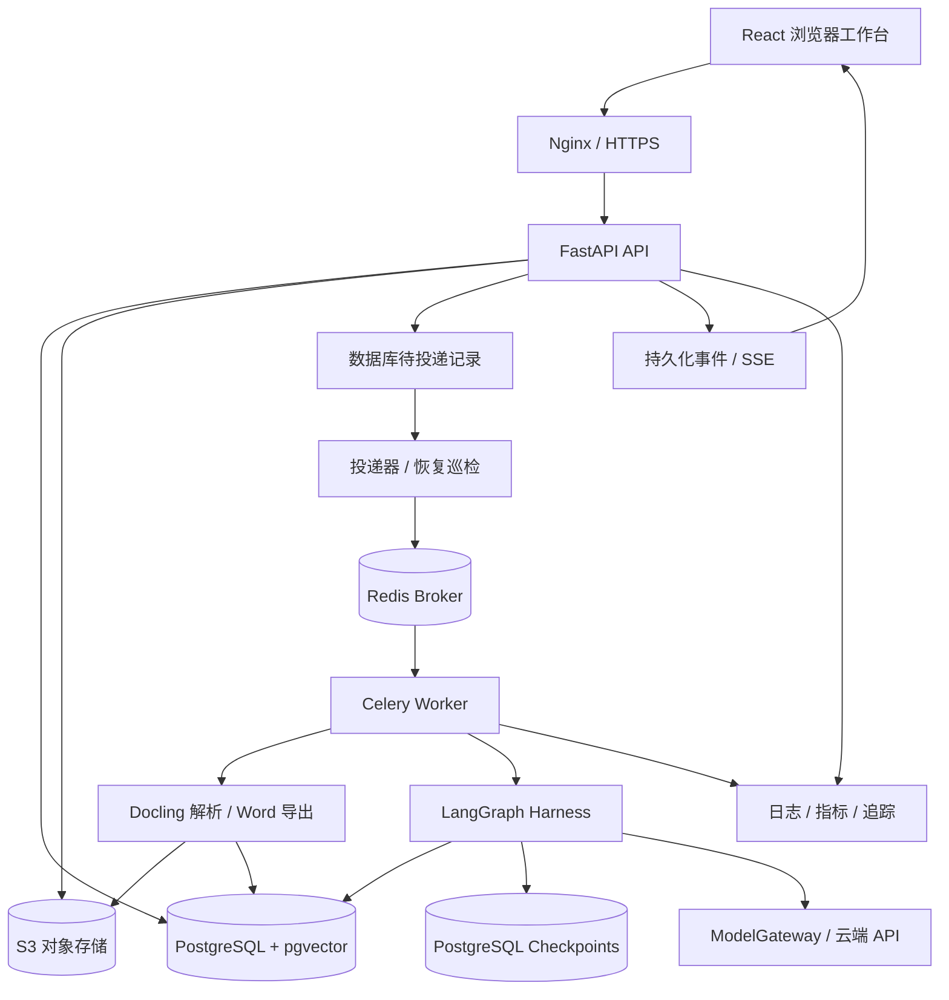

# 工程标书 AI Harness Agent 开发方案

> 版本：v1.0 ｜ 日期：2026-10-07 ｜ 状态：待实现的设计基线
>
> 本文描述目标产品与实施范围，不代表相应功能或性能已经实现。

## 1. 文档定位与阅读顺序

本项目面向 AI 应用后端求职场景，同时按真实业务产品的方式建设。目标是交付具有完整前端、后端、数据库、后台执行和部署能力的 Web 应用。

配套文档：

- [开发文档.md](./开发文档.md)：模块职责、实现流程、工程规范、测试和运维。
- [API文档.md](./API文档.md)：外部接口、请求响应、权限、状态与错误语义。
- [数据库文档.md](./数据库文档.md)：表结构、关系、约束、事务、索引与迁移。

修改产品范围先更新本文；修改外部行为同步更新 API 文档；修改持久化行为同步更新数据库文档。字段、枚举和接口以对应专门文档为准；冲突应在实现前通过架构决策记录解决，不能由代码静默决定。

## 2. 产品定位

### 2.1 目标用户与问题

主要用户为施工企业的技术标编写人员、技术负责人和审核人员。现有工作通常涉及大量招标文件阅读、企业资料查询、历史文本复用、评分项检查和 Word 排版。

产品定位：**面向工程技术标的、具备证据追溯与人工审核能力的 AI 撰写工作台。**

核心链路：招标要求 → 已确认项目事实 → 企业资料和参考资料 → 章节内容 → 审查问题 → 人工审核 → 导出草稿。

产品不以聊天记录作为主要成果。可长期保存和追踪的业务成果包括要求清单、项目基准、章节版本、引用证据、审查报告、审核记录与导出快照。

### 2.2 价值验证

| 价值 | 验证方式 | 展示口径 |
|---|---|---|
| 提速 | 对相同任务记录查资料、生成、审核、修改与排版总耗时 | 报告完整工作耗时，不只统计模型生成时间 |
| 提高响应质量 | 对照人工标注的要求与评分项检查覆盖情况 | 展示完整、部分、未响应、待确认 |
| 提高针对性 | 行业人员盲评普通直接生成与本系统输出 | 报告样本、评分维度和失败案例 |
| 降低遗漏与误用 | 注入工期冲突、历史人员误用、缺失资料等问题 | 报告发现率与误报率 |
| 便于协作复核 | 逐段查看来源、历史版本、审查与审核动作 | 展示可复现的证据链 |

不展示未经验证的“必然中标”“提升多少实际评标分”等承诺。评分响应情况不是正式评标分数。

## 3. 首版范围与默认决策

| 维度 | v1 决策 |
|---|---|
| 技术主线 | Python AI 应用后端，前端采用 React |
| 投入 | 12 周主计划，每周 15–25 小时；8 周压缩版本见第 11 节 |
| 工程细分 | 第 1 周按现有获准使用的样本锁定一个工程类型 |
| 重点章节 | 3–5 类，优先施工方案、进度安排、质量、安全、资源配置 |
| 输入 | 可复制文字的 PDF 与 DOCX；扫描件返回明确不支持或需转换提示 |
| 输出 | 固定模板的可编辑 DOCX，区分审阅版和提交草稿 |
| 模型 | 单一云端供应商，默认百炼通义千问；模拟模式单独标识 |
| 资料 | 仅使用授权允许的脱敏资料；必要片段获准外发后才能调用模型 |
| 协作 | 组织内共享项目，管理员、编写者、审核者；不做实时共同编辑 |
| 租户 | 多组织数据隔离；v1 一个用户账号归属一个组织 |
| 部署 | 单机 Docker Compose、公网演示、本地启动；不宣称多机高可用 |
| 演示 | 使用可公开的模拟资料，关闭开放注册，预置演示账号 |

账号采用组织内邮箱唯一，登录需要组织标识。v1 不支持跨组织账号切换，后续通过独立账号与成员关系迁移扩展。

明确不在 v1 范围：报价计算、工程量清单计价、图纸理解、BIM、电子签章、自动投标、通用浏览器代理、任意代码执行、扫描 OCR、复杂甘特图生成、通用 Word 模板完全还原、实时协同编辑、多供应商自动切换。

已有人工章节可与生成章节一起整合导出。首版不要求 AI 生成完整技术标的所有章节。

## 4. 业务能力与闭环

### 4.1 角色

| 角色 | 能力 |
|---|---|
| 管理员 admin | 成员与组织配置、项目和资料管理、编写与审核权限；仍不能审核自己创建的版本 |
| 编写者 writer | 上传资料、修订与确认要求、编辑章节、生成、发起审查、导出审阅版 |
| 审核者 reviewer | 阅读资料与内容、发起审查、处理允许处置的问题、审核、导出符合条件的提交草稿 |

所有角色可阅读本组织未归档项目。v1 不提供项目级访问控制清单；组织隔离是权限边界。

### 4.2 主流程

1. 创建项目，填写工程名称与工程类型。
2. 上传招标文件、企业资料、历史标书或技术参考资料。
3. 系统解析，用户查看原文定位并确认资料可用性和外发许可。
4. 对已解析的招标文件发起分析，生成待确认要求、评分项和项目事实。
5. 用户修订、确认要求与事实，发布不可变的项目基准 baseline。
6. 根据目录创建章节，将要求映射到章节。
7. 对重点章节发起生成，系统检索证据并检查资料缺口。
8. 需要补充资料时暂停；用户补资料后建立新运行，或明确允许保留待补项后恢复原运行。
9. 生成候选版本，执行规则检查和模型审查，必要时有限修订。
10. 编写人员比较并选择候选版本，继续人工修改；所有修改建立新版本。
11. 对选定版本发起完整审查，审核人员审核。
12. 导出不可变快照，并保留版本、审查、审核和文件关联。

### 4.3 前端页面

| 页面 | 主要内容与动作 |
|---|---|
| 登录 | 组织标识、邮箱、密码、错误提示 |
| 项目列表 | 新建、查询、归档、项目状态 |
| 资料中心 | 文件上传、用途、解析与索引状态、版本、确认与外发许可 |
| 招标分析 | 要求、评分项、事实、来源定位、修订确认、发布基准 |
| 章节工作台 | 左侧目录，中间编辑器，右侧要求、证据、审查问题 |
| 运行详情 | 阶段、暂停原因、事件、恢复、取消、错误、Token 与费用估算 |
| 审查与审核 | 要求响应、冲突、引用问题、人工处置、审核记录 |
| 导出记录 | 审阅版与提交草稿、来源版本、文件下载 |
| 成员管理 | 新建组织内账号、角色调整、停用 |

关键交互要求：不隐藏失败；不把候选版本自动覆盖到人工内容；冲突时保留用户未保存内容；重新连接后可恢复运行进度；所有引用可打开来源。

## 5. 总体架构

采用模块化单体业务后端与独立后台任务进程。模块共享代码和主数据库，API、任务投递器、Worker 可独立运行。

### 5.1 技术选型

| 子系统 | 选型 | 理由与边界 |
|---|---|---|
| 前端 | React、TypeScript、Vite | 类型化页面开发，前后端独立构建 |
| 组件与编辑 | Ant Design、Tiptap、PDF.js | 管理界面、限定富文本结构、PDF 定位 |
| 请求状态 | TanStack Query | 缓存、刷新、异步运行状态 |
| API | FastAPI、Pydantic | 输入校验、OpenAPI、依赖式鉴权 |
| ORM 与迁移 | SQLAlchemy、Alembic | 事务与结构版本管理 |
| 数据库 | PostgreSQL、pgvector | 业务关系、全文检索、向量索引同库 |
| 任务 | Celery、Redis | 后台耗时任务；业务状态不以 Broker 为准 |
| Harness | LangGraph、PostgreSQL Checkpointer | 节点状态、人工中断、恢复 |
| 文档 | Docling、python-docx | 结构化解析、固定模板 DOCX 导出 |
| 文件 | S3 存储接口、SeaweedFS | 统一对象访问，后续可替换托管存储 |
| 模型 | ModelGateway、百炼 | 单供应商起步，隔离 SDK 与模型变化 |
| 交付 | Docker Compose、Nginx、GitHub Actions | 单机运行、反向代理、CI |
| 可观测性 | OpenTelemetry、Prometheus、Grafana | 链路、运行指标、故障定位 |

建议开发基线为 Python 3.12、Node.js 22 LTS、PostgreSQL 17、Redis 7。这些是项目兼容基线，不声称是最新版本。首次实现后锁定验证过的补丁版本、依赖锁文件和镜像 digest；禁止公网环境使用漂移的 latest 镜像。

### 5.2 模块边界

API 层负责 HTTP、鉴权和输入输出转换；应用服务负责业务流程和事务；领域层负责状态转换与校验；基础设施层实现数据库、队列、模型和文件接口。

后端模块：identity、projects、documents、analysis、retrieval、chapters、harness、reviews、exports、operations。Celery 任务调用应用服务，不在任务函数里复制 API 的业务规则。

外部服务不参加数据库长事务。文件上传、模型调用、Broker 投递均通过分阶段提交与幂等协调。

## 6. 数据与证据设计

### 6.1 三类事实边界

- 招标事实：来自本项目招标文件，经人工确认，如工期、质量目标。
- 企业事实：来自已确认企业资料，如业绩、人员、设备；不能从历史标书猜测。
- 拟采用措施：针对当前工程提出的方案或建议，不伪装成已落实的企业能力。

资料分类固定为 tender、enterprise、historical、reference。组织级共享资料只能是后三类；tender 必须绑定项目。

### 6.2 关键持久化成果

| 成果 | 持久化要求 |
|---|---|
| 文档 | 逻辑文件与文件版本分离，原文件不可变 |
| 文档块 | 保留章节路径、段落或表格、来源定位 |
| 项目基准 | 保存要求、事实、资料许可与版本的完整快照 |
| 章节 | 目录位置与当前选定版本分离 |
| 章节版本 | 内容不可变；人工修改和生成均建立新版本 |
| 引用 | 关联版本、内容块、资料块和被支持的主张 |
| 审查 | 绑定项目基准与具体章节版本 |
| 审核 | 绑定版本和完成的审查报告，不跨版本沿用 |
| 运行 | 输入快照、状态、节点、预算、事件、租约 |
| 导出 | 固定模板版本、章节版本清单和审核依据 |

PDF 定位保存实际页码及区域；DOCX 定位保存标题路径、段落序号或表格单元格。DOCX 不人为生成页码。

确认要求、事实、资料可用性或目录配置发生变化时，项目设置 baseline_dirty=true，相关章节标记需要复核。重新发布基准后恢复生成资格；保留历史审核记录，但不允许旧基准审核支撑新基准提交。上传文件新版本不会自动替换基准中的旧版本。

## 7. Harness 与检索

### 7.1 检索

中文先在应用层分词，入库与查询共用词典版本。编号、型号、标准编号作为受保护词。词项写入 PostgreSQL simple 全文检索配置；向量检索使用 pgvector，两个通道以 RRF 合并。

候选范围先限定组织、项目或组织共享资料、资料用途、确认状态和索引配置。生成可使用的资料还必须允许必要片段外发。历史标书只用于表达或方法参考。

首版 Embedding 输出维度固定为 1024。更换模型或分词配置建立新 index_profile，词项与向量索引均按 profile 保存；改变切块需要新的文档版本。不混用不同空间的向量，正在运行的任务继续引用其冻结配置。初期小样本使用精确向量检索，数据增长且评测支持时再创建 HNSW。

### 7.2 生成图

固定流程：prepare → retrieve → gap_check → generate → rule_check → semantic_review → bounded_revise → persist_candidate。

- 有缺口时通过人工中断返回结构化问题，不占用等待中的 Worker。
- 原运行只允许确认保留待补项；新增资料要重新发布基准并创建新运行，防止悄悄改变快照。
- 修订最多两轮。每个模型步骤校验输出结构，失败可进行一次格式修复。
- 每章一个 generate 运行，项目同时执行的生成运行最多两个。
- 产物是候选版本，用户显式采用后才改变章节当前内容。
- 上传文档按非可信资料处理，不能改变系统指令或工具权限。

工具白名单只包含资料检索、事实查询、校验和候选产物保存。首版不提供通用 shell、外部浏览器或任意 URL 抓取工具。

### 7.3 可靠性

运行创建与 outbox 写入同一事务。投递器至少一次送入 Celery；Worker 通过数据库租约与 fencing token 领取运行。节点副作用以稳定幂等键提交。

PostgreSQL Checkpoint 用于图恢复；业务产物表是用户成果的依据。进程可能在产物提交与 Checkpoint 更新之间退出，恢复节点先查询已有产物再执行。

心跳、租约过期恢复、排队未领取重新投递用于处理 Worker 崩溃和 Broker 丢失。完成、失败、取消的运行不自动重新执行。

模型调用只对可恢复的限流或网络异常退避重试。超时后是否已经计费可能不确定，保留 unknown 用量状态，不承诺外部调用 exactly-once。

### 7.4 预算与成本

默认单章运行最多 12 次调用、60,000 Token、两轮内容修订；费用上限由组织配置。前两者是产品资源配额，不是模型价格。

真实模型模式必须配置密钥、部署区域、具体模型标识、Embedding 配置及定价配置。调用前预留预算，返回后结算；不确定调用保留预留并提示可能重复费用。不能保证外部账单绝不超预算。

模拟模式不调用云端，所有界面、事件、章节元数据与评测报告明确标注 simulated；模拟结果不能用于声称真实模型效果达标。

## 8. 审查、审核与导出

规则检查负责确定性问题：确认工期、工程名称、关键数值、章节缺失、引用失效。语义审查负责评分项响应、针对性和证据是否支持主张。

要求响应状态：complete、partial、missing、needs_confirmation。问题等级：blocker、high、medium、low。

blocker 不允许通过手工“接受风险”绕过；修正资料或章节后重新审查。其他问题可按角色与理由处置，留审计记录。规范引用只来自已上传并确认的资料，不宣称自动完成法律或规范适用性判断。

审核者不能批准自己创建的章节版本，包括管理员。人工修改生成新版本后必须重新审查和审核。

| 导出模式 | 规则 |
|---|---|
| review 审阅版 | 编写者可导出，保留来源摘要、问题与待补项，明确标记草稿 |
| submission_draft 提交草稿 | 所有选定章节已获当前基准下的审核，无待补项、未解决高等级问题或需复核标记 |

审阅版包含内部说明；提交草稿省去内部引用标记，但后台保留完整证据链。导出文件仍需人工核对，v1 不承诺满足所有投标平台格式要求。

## 9. 安全、可观测性与部署

### 9.1 安全边界

- 同源 Cookie 会话，HttpOnly、生产 Secure、SameSite=Lax；写操作校验 CSRF 与 Origin。
- 后端从会话确定组织，拒绝客户端直接指定 org_id。
- 业务表启用 RLS，应用账号不是表 owner、不是超级用户、不具备 BYPASSRLS。
- 检索、事件流、Checkpoint 访问、文件与导出下载均经过授权。
- 文件不公开，通过受权接口流式下载；S3、数据库和 Redis 端口不暴露公网。
- 不记录密码、Cookie、密钥、完整原文、完整提示词；追踪默认只记录标识和摘要。
- 成员停用后撤销会话。文件外发许可撤销后，待执行步骤重新检查，不能仅依赖旧快照。

### 9.2 可观测性

请求与任务共享 request_id、run_id、trace_id。重点指标包括运行成功率、节点耗时、队列等待、租约恢复次数、模型限流、格式校验失败、Token 与费用估算、引用有效率、业务接口 P95。

日志不保存或展示模型隐藏推理。公开运行详情展示执行步骤、输入摘要、产物和问题。

### 9.3 部署与恢复

本地与演示环境使用同一套容器服务：web、api、dispatcher、worker、postgres、redis、seaweedfs。monitoring 为可选 Compose profile。

启动顺序：基础服务健康 → 数据库迁移 → 组织与演示数据初始化 → API、投递器与 Worker → 前端。

应用更新通过固定镜像发布；破坏性数据库变化采用扩展、迁移、收缩分阶段实施。备份包含数据库、对象文件、模板和配置版本；密钥单独管理。

单机故障仍会导致服务不可用；首版展示恢复演练，不将备份等同于高可用。

## 10. 测试、评测与完成标准

| 方向 | 必须覆盖 | 初始目标 |
|---|---|---|
| 抽取 | 人工标注的要求与事实、合并表格、来源锚点 | 关键要求召回率 ≥90%，同时报告准确率 |
| 检索 | 按项目划分的保留问题、编号与中文术语 | Recall@10 ≥90% |
| 引用 | 锚点存在、权限有效、原文支持主张 | 锚点可打开 100%；支持率抽样目标 ≥90% |
| 事实 | 缺失业绩、人员与设备 | 专项测试中不虚构企业事实 |
| 内容 | 行业人员盲评、直接提示生成基线 | 报告维度、分布、失败案例，不预设提升结论 |
| 可靠性 | 重复投递、Worker 退出、Redis 重启、模型超时 | 可恢复、无重复业务产物 |
| 并发 | 编辑与生成并行、重复采用版本、过期审核 | 不覆盖人工内容，不沿用过期审核 |
| 权限 | 跨组织项目、资料、索引、事件、文件、运行 | 不泄漏内容与存在性 |
| 导出 | 中文字体、层级、基础表格、审核快照 | 可编辑、可打开、人工检查 |
| 性能 | 记录硬件和数据规模的 20 用户普通请求 | 普通接口 P95 <500ms，模型任务分开统计 |
| 运维 | 数据库与文件恢复到空环境 | 项目、版本、引用和导出关联完整 |

不少于五个独立项目作为最终评测目标；真实材料尚未交付，因此当前只能建立评测流程，不能宣称上述质量指标已经达标。

测试分层：纯业务单元测试、真实 PostgreSQL 集成测试、模拟供应商合同测试、浏览器端到端测试、手动触发云端模型评测、故障与恢复演练。

## 11. 开发阶段与交付清单

| 阶段 | 周次 | 交付内容 | 阶段验收 |
|---|---|---|---|
| P0 业务基准 | 1 | 样本盘点、工程细分、重点章节、标注规则、ADR | 行业人员确认范围，样本授权可追踪 |
| P1 产品骨架 | 2–3 | 登录、组织、项目、文件上传、迁移、后台任务与运行事件 | 可在本地完整启动，跨组织测试通过 |
| P2 分析与检索 | 4–5 | 结构化解析、定位、要求事实确认、基准、索引与检索 | 输入内容可追溯，确认与版本一致 |
| P3 单章闭环 | 6–7 | Harness、缺口暂停、恢复、预算、候选版本、规则审查 | 断点恢复、重复投递和并发修改测试通过 |
| P4 重点章节 | 8–9 | 3–5 类章节、语义审查、审核、模板导出 | 审阅与提交草稿限制生效 |
| P5 验证与展示 | 10–12 | 行业评测、压测、恢复演练、公网演示、文档与录像 | 提供证据，明确未达标项与限制 |

8 周版本减少到三类重点章节，简化差异比较界面与监控布局，不删除隔离、证据、版本、恢复和关键测试。

最终求职交付：可运行仓库、公网演示、本地启动说明、架构与 ADR、API 与数据库文档、评测报告、权限和恢复测试证据、完整业务演示录像。

## 12. 风险与依赖

| 风险 | 处理 |
|---|---|
| 真实样本不足 | 先建立明确标注的模拟样本，质量结论延后 |
| 扫描件与复杂格式 | v1 显式返回格式边界，不生成空内容假成功 |
| 模型编造事实 | 事实类别隔离、证据约束、规则与人工审核 |
| 长文成本失控 | 章节运行、上下文上限、调用预算、有限修订 |
| 依赖模型下载与算力 | Docling 模型在构建或初始化阶段准备，演示前测资源 |
| 工程规范理解错误 | 引用受控资料，行业人员审查，不自动推断适用性 |
| 本地环境版本不足 | 采用容器和明确兼容基线，不要求使用系统旧 Python |
| 公网部署条件不足 | 仓库提供部署配置；域名、证书、服务器和密钥另行配置 |

## 13. 技术依据

以下是本方案核对过的官方技术依据，查阅日期为 2026-10-07；具体依赖版本以实施时锁文件和集成测试结果为准。

- [LangGraph 持久化](https://docs.langchain.com/oss/python/langgraph/persistence)：生产 Checkpointer 的持久化与恢复能力。
- [LangGraph 人工中断](https://docs.langchain.com/oss/python/langgraph/interrupts)：人工介入和恢复语义。
- [Celery Tasks](https://docs.celeryq.dev/en/stable/userguide/tasks.html)：重试、确认与幂等任务要求。
- [PostgreSQL RLS](https://www.postgresql.org/docs/current/ddl-rowsecurity.html)：行级策略与角色边界。
- [pgvector](https://github.com/pgvector/pgvector)：精确与近似检索、混合检索及过滤注意事项。
- [Docling 输入格式](https://docling-project.github.io/docling/usage/supported_formats/)：输入格式与统一表示能力。
- [SeaweedFS](https://github.com/seaweedfs/seaweedfs)：S3 存储与简化部署。
- [百炼结构化输出](https://docs.modelstudio.console.alibabacloud.com/en/model-studio/qwen-structured-output)：结构化输出支持与限制。

