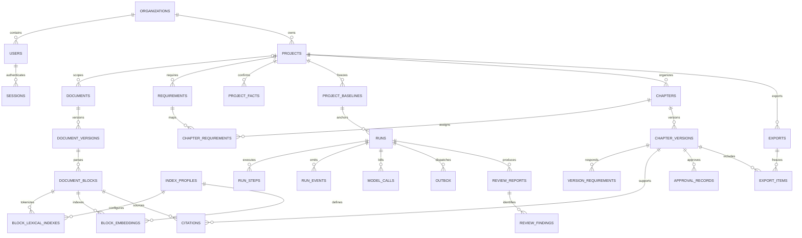

# 工程标书 AI Harness Agent 数据库文档

> 版本：v1.0 ｜ 日期：2026-10-07 ｜ 状态：逻辑与物理设计基线，尚未执行迁移
>
> 业务见 [开发方案.md](./开发方案.md)，实现见 [开发文档.md](./开发文档.md)，接口见 [API文档.md](./API文档.md)。

## 1. 存储职责与设计原则

PostgreSQL 是业务状态与成果的唯一事实来源，pgvector 存放向量。S3 存放原文件、解析产物和导出 DOCX。Redis 仅作为任务 Broker 和短期协调设施，丢失 Redis 不能导致已提交业务成果消失。

设计原则：

- 组织隔离字段明确，不能仅靠查询中偶尔添加过滤条件。
- 不可变文件、基准、正文版本与可变工作记录分离。
- 重要关系采用外键，不能把所有业务内容都塞进 JSONB。
- JSONB 仅用于文档结构、业务快照、工具结果和供应商元数据等确实需要扩展的内容。
- 审查、审核和导出关联具体版本，历史结果不跨版本继承。
- 长任务的状态、事件、租约、预算与产物保存在数据库。
- 本文的 SQL 是迁移设计示例，不代表完整可直接执行的建库脚本。

## 2. 数据库、schema 与角色

### 2.1 环境

基线 PostgreSQL 17、pgvector，UTF-8。开发、测试、演示使用独立数据库。日期时间使用 timestamptz，数据库按 UTC 连接；页面按 Asia/Shanghai 展示。

v1 Embedding 固定 vector(1024)，索引空间由 index_profiles 标识。不同模型产生的向量不能跨 profile 比较。

### 2.2 schema

| schema | 表与用途 | 访问方式 |
|---|---|---|
| auth | organizations、users、sessions | 认证专用仓储，不能被普通业务连接读取 |
| app | 项目、文档、章节、运行、审查、导出 | app_runtime，全部启用 RLS |
| ops | outbox、idempotency_keys | 在线业务连接受 RLS 访问；调度连接仅访问 outbox |
| agent | LangGraph 官方 Checkpointer 表 | graph_runtime，通过受控运行适配器访问 |

本设计包含 30 张自有业务／协调表。agent 的内部表由锁定版本的 Checkpointer 管理，不按猜测复制其表结构。

### 2.3 角色

| 角色 | 权限 |
|---|---|
| migration_owner | 执行迁移、创建扩展、建表与策略；不作为在线连接 |
| app_runtime | app 及两张 ops 表所需 DML，受 RLS 约束；无 owner、superuser、BYPASSRLS |
| auth_service | auth 账号、会话与组织配置所需权限；无 app 内容权限 |
| ops_runtime | 仅 outbox 调度所需权限；不读取幂等响应或文档正文 |
| graph_runtime | agent 持久化所需权限；不开放给 HTTP 查询 |
| backup_operator | 受控备份恢复，不用于应用请求 |

auth、agent 包含服务需要的跨组织元数据，不声称其内部表天然具备 app 的 RLS 隔离。通过独立凭据、私有仓储、入参限制和审计控制；用户 API 不允许直接查询这些 schema。ops 采用按数据库角色区分的 RLS：业务连接只能操作当前组织的数据，调度连接仅能访问 outbox 的跨组织调度元数据。

agent thread_id 固定为 run_id，checkpoint_ns 固定包含组织 ID。适配器每次访问前用受 RLS 保护的 app.runs 验证组织与运行归属，客户端不能直接提交 thread_id 或 namespace。

## 3. 通用字段与约束

### 3.1 字段约定

| 字段／类型 | 约定 |
|---|---|
| id uuid | 主键，应用生成 UUIDv4 |
| org_id uuid | app 和 ops 表必填；引用 auth.organizations |
| created_at timestamptz | NOT NULL，默认数据库 now() |
| updated_at timestamptz | 可变表必填，应用在更新时设置 |
| lock_version integer | 用户可修改的记录必填，默认 1，CHECK >0 |
| created_by uuid | 有用户来源的记录，关联同组织用户；系统事件允许空 |
| sha256 / content_hash / snapshot_hash char(64) | 小写十六进制字符串，服务端计算 |
| 费用 numeric(18,6) | CNY，非负；API 序列化为字符串 |
| 分值 numeric(10,2) | 非负；未知必须 NULL |
| 枚举 varchar | 使用 CHECK 约束，迁移可显式扩展，不使用无约束文本 |

下文表字典中的“可空”字段允许 NULL，其余字段均 NOT NULL，除非明确写出条件规则。所有自有表包含 id 与 created_at；不可变表没有 updated_at 和 lock_version。表中特别列出的字段是除这些通用字段以外的完整业务字段。

app 表统一包含 org_id，并建立 UNIQUE(org_id,id) 作为租户复合外键目标。含项目的表额外建立必要的 UNIQUE(org_id,project_id,id)，阻止同组织跨项目的错误关联。

created_by、updated_by、published_by、resolved_by、approved_by 等用户字段采用同组织复合外键到 auth.users(org_id,id)。服务生成内容的 created_by 记录发起人，而不是虚构的 AI 用户。

### 3.2 关系校验

- 所有业务父子关系均使用 org_id 参与外键。
- 项目基准、章节、章节版本、审查和导出必须在同项目关联。
- 文档允许 project_id=NULL，代表组织共享资料；来源块可指向同项目或共享资料，使用应用校验或约束触发器检查。
- 引用和要求来源不得指向同组织的其他项目文件；仅 org_id 一致不够。
- 目录 parent_id 必须同项目，禁止循环由服务校验；同级 position 唯一。
- JSON 内的 block_id、证据与快照数据必须由服务验证，不能依靠普通外键自动保证。

### 3.3 删除策略

项目、文档和用户采用归档或停用；重要业务外键 ON DELETE RESTRICT。没有面向用户的物理删除项目、章节、基准和版本接口。

任务事件与幂等记录按保留期清理；运行和成果不随事件清理删除。涉及隐私或合同要求的资料删除由受控运维流程执行，先撤销使用、标记来源不可用、使相关提交草稿失效，再按保留政策处理备份；不能承诺已外发资料被云端立即删除。

## 4. 关系图



图用于说明主要关联；可空关系、循环指针、租户复合约束以表字典为准。

## 5. auth 表

### 5.1 auth.organizations

| 字段 | 类型 | 规则 |
|---|---|---|
| slug | varchar(100) | 小写字母、数字和连字符，全局唯一 |
| name | varchar(200) | 展示名称 |
| is_active | boolean | 默认 true |
| settings_json | jsonb | 默认运行上限和费用上限，不含密钥 |
| updated_at | timestamptz | 可变 |
| lock_version | integer | 默认 1 |

settings_json 固定字段：run_max_calls=12、run_max_tokens=60000、run_max_cost_cny=null。组织上限不能超过全局安全上限。

### 5.2 auth.users

| 字段 | 类型 | 规则 |
|---|---|---|
| org_id | uuid | 组织 |
| email | varchar(254) | 应用规范化为小写，不存重复规范化邮箱 |
| display_name | varchar(50) | 显示名 |
| password_hash | text | Argon2id，不能从 API 读取 |
| role | varchar(20) | admin / writer / reviewer |
| is_active | boolean | 默认 true |
| must_change_password | boolean | 新建账号默认 true |
| failed_login_count | integer | 默认 0，非负 |
| locked_until | timestamptz | 可空，失败锁定截止时间 |
| last_login_at | timestamptz | 可空 |
| updated_at | timestamptz | 可变 |
| lock_version | integer | 默认 1，仅用户资料变更递增 |

UNIQUE(org_id,email)、UNIQUE(org_id,id)。不把邮箱作为业务外键。账号不存在与密码错误对外使用相同响应。

### 5.3 auth.sessions

| 字段 | 类型 | 规则 |
|---|---|---|
| org_id | uuid | 会话绑定组织 |
| user_id | uuid | 同组织用户 |
| token_hash | char(64) | 随机会话 Token 的 SHA-256，全局唯一 |
| csrf_token_hash | char(64) | 会话关联 CSRF Token 的哈希 |
| expires_at | timestamptz | 默认创建后 12 小时 |
| revoked_at | timestamptz | 可空 |
| last_seen_at | timestamptz | 可空，节流更新 |
| updated_at | timestamptz | 撤销或最近访问更新 |

原始会话 Token 不落库。CSRF Token 由 CSRF_SIGNING_KEY 和原始 Cookie Token 派生，因此 me 可重新计算并返回；校验使用常量时间比较。轮换签名密钥时撤销旧会话。

## 6. 项目与文档表

### 6.1 app.projects

| 字段 | 类型 | 规则 |
|---|---|---|
| name | varchar(200) | 项目名称 |
| construction_type | varchar(100) | 工程细分 |
| description | text | 默认空，最大 2,000 字符 |
| data_classification | varchar(20) | synthetic / deidentified / confidential |
| status | varchar(20) | active / archived |
| current_baseline_id | uuid | 可空，同项目基准 |
| baseline_dirty | boolean | 默认 true |
| created_by | uuid | 发起人 |
| updated_at | timestamptz | 可变 |
| lock_version | integer | 默认 1 |

项目归档不删除内容。current_baseline_id 的复合外键后置添加，防止循环建表依赖。

### 6.2 app.documents

| 字段 | 类型 | 规则 |
|---|---|---|
| project_id | uuid | 可空，组织共享资料 |
| title | varchar(200) | 展示标题 |
| kind | varchar(20) | tender / enterprise / historical / reference |
| status | varchar(20) | active / archived |
| current_version_id | uuid | 可空，初始化后指向最新上传版本 |
| created_by | uuid | 上传者 |
| updated_at | timestamptz | 可变 |
| lock_version | integer | 默认 1 |

CHECK(kind <> 'tender' OR project_id IS NOT NULL)。current_version_id 必须属于本 document，而不是任意同组织版本；使用版本表 UNIQUE(org_id,document_id,id) 建立复合外键。

### 6.3 app.document_versions

| 字段 | 类型 | 规则 |
|---|---|---|
| document_id | uuid | 同组织逻辑文件 |
| version_no | integer | 从 1 增加 |
| original_filename | varchar(255) | 清洗后仅展示 |
| media_type | varchar(100) | PDF 或 DOCX 类型 |
| byte_size | bigint | >0，≤上传上限 |
| sha256 | char(64) | 原文件校验和 |
| object_key | text | 私有对象键，不返回 API |
| parsed_object_key | text | 可空，Docling JSON 产物 |
| parse_status | varchar(20) | pending / parsing / parsed / failed / unsupported |
| verification_status | varchar(20) | draft / confirmed / rejected |
| index_status | varchar(20) | pending / indexing / ready / failed / outdated |
| embedding_available | boolean | 默认 false，对当前索引配置计算维护 |
| allow_external_processing | boolean | 默认 false |
| permission_note | text | 默认空，许可改变时要求说明 |
| verified_by | uuid | 可空 |
| verified_at | timestamptz | 可空 |
| parser_version | varchar(100) | 可空，完成解析后必填 |
| parse_error_code | varchar(100) | 可空，不保存敏感堆栈 |
| created_by | uuid | 上传者 |
| updated_at | timestamptz | 状态可变，文件内容不可变 |
| lock_version | integer | 默认 1，许可与确认编辑时增加 |

UNIQUE(org_id,document_id,version_no)，UNIQUE(org_id,object_key)，UNIQUE(org_id,document_id,id)。同 SHA-256 不跨组织合并，避免存在性泄漏；可以提示同组织重复内容，但允许作为明确的新版本上传。

### 6.4 app.document_blocks

| 字段 | 类型 | 规则 |
|---|---|---|
| document_version_id | uuid | 已解析版本 |
| ordinal | integer | 从 0 起，同版本唯一 |
| block_type | varchar(20) | heading / paragraph / table |
| heading_path | jsonb | 字符串数组 |
| text | text | 纯文本，包括表格可检索文本 |
| table_data | jsonb | 可空，table 时提供单元格结构 |
| source_locator | jsonb | PDF 或 DOCX 判别结构 |
| content_hash | char(64) | 块正文与定位的哈希 |

UNIQUE(org_id,document_version_id,ordinal)。解析块的正文与定位不可改写。词项保存于独立索引表，分词升级不覆盖旧任务使用的索引。若需改变切块或定位，建立新文档版本并重新解析。

### 6.5 app.index_profiles

| 字段 | 类型 | 规则 |
|---|---|---|
| name | varchar(100) | 配置名称 |
| version_no | integer | 正整数 |
| embedding_provider | varchar(50) | 供应商或 simulated |
| embedding_model | varchar(150) | 具体部署标识 |
| embedding_dimension | integer | v1 CHECK=1024 |
| tokenizer_version | varchar(100) | 中文切词配置版本 |
| chunker_version | varchar(100) | 切块配置版本 |
| config_hash | char(64) | 规范化配置哈希 |
| status | varchar(20) | building / active / retired |
| updated_at | timestamptz | 配置本身不可改写，仅状态可变 |

UNIQUE(org_id,name,version_no)，UNIQUE(org_id,config_hash)，一个组织仅允许一个 active profile（部分唯一索引）。服务配置管理，不提供用户任意修改模型标识的接口。retired 配置及索引保留到引用它的活动运行结束，旧运行可使用冻结 profile，不能自动改用新模型。

### 6.6 app.block_embeddings

| 字段 | 类型 | 规则 |
|---|---|---|
| block_id | uuid | 原文块 |
| index_profile_id | uuid | 同组织配置 |
| embedding | vector(1024) | 必须维度匹配且非零向量 |
| source_content_hash | char(64) | 与块内容一致 |
| source_run_id | uuid | index 运行 |

UNIQUE(org_id,block_id,index_profile_id)。不同 profile 向量可以存于同表，但查询必须选择完全相同的 profile；v1 不建立跨空间近似索引。

### 6.7 app.block_lexical_indexes

| 字段 | 类型 | 规则 |
|---|---|---|
| block_id | uuid | 原文块 |
| index_profile_id | uuid | 同组织分词与切块配置 |
| searchable_text | text | 应用分词后的标题与正文 |
| content_tsv | tsvector | to_tsvector('simple',searchable_text)，由数据库计算 |
| source_content_hash | char(64) | 与解析块内容一致 |
| source_run_id | uuid | index 运行 |

UNIQUE(org_id,block_id,index_profile_id)。同配置产物不可改写，分词升级写新 profile 行；无需外发的资料也能建立此表记录。Embedding 不是词项索引 ready 的必要条件。

## 7. 要求、事实与基准表

### 7.1 app.requirements

| 字段 | 类型 | 规则 |
|---|---|---|
| project_id | uuid | 所属项目 |
| title | varchar(200) | 要求摘要 |
| original_text | text | 原文或人工明确输入，最大 10,000 字符 |
| response_guidance | text | 默认空，最大 5,000 字符 |
| category | varchar(20) | mandatory / scoring / general |
| score_max | numeric(10,2) | 可空，原文明示才填写 |
| status | varchar(20) | draft / confirmed / rejected |
| source_type | varchar(20) | document / manual |
| source_block_id | uuid | 可空，document 必填 |
| manual_source_note | text | 可空，manual 必填 |
| allow_external_processing | boolean | 默认 false，仅用于 manual 来源 |
| source_run_id | uuid | 可空，抽取任务 |
| extraction_fingerprint | char(64) | 可空，同一分析运行内去重 |
| confirmed_by | uuid | 可空 |
| confirmed_at | timestamptz | 可空 |
| created_by | uuid | 用户或任务发起人 |
| updated_at | timestamptz | 可变 |
| lock_version | integer | 默认 1 |

CHECK 来源二选一规则；UNIQUE(org_id,source_run_id,extraction_fingerprint)，NULL 不参与去重。跨运行的语义差异由服务判断，不覆盖 confirmed 数据。

### 7.2 app.project_facts

| 字段 | 类型 | 规则 |
|---|---|---|
| project_id | uuid | 所属项目 |
| fact_key | varchar(100) | 稳定事实键 |
| label | varchar(200) | 显示名 |
| value_json | jsonb | value_type 与 value |
| unit | varchar(50) | 可空 |
| fact_kind | varchar(20) | tender / enterprise |
| status | varchar(20) | draft / confirmed / rejected |
| source_type | varchar(20) | document / manual |
| source_block_id | uuid | 可空，document 必填 |
| manual_source_note | text | 可空，manual 必填 |
| allow_external_processing | boolean | 默认 false，仅 manual 有效 |
| source_run_id | uuid | 可空 |
| extraction_fingerprint | char(64) | 可空 |
| confirmed_by | uuid | 可空 |
| confirmed_at | timestamptz | 可空 |
| created_by | uuid | 用户或任务发起人 |
| updated_at | timestamptz | 可变 |
| lock_version | integer | 默认 1 |

value_type 允许 text、number、date、boolean、list，应用校验 value 对应类型。confirmed 的 fact_key 在项目内唯一（部分唯一索引），draft 允许同键候选，方便处理矛盾。

来源 document 的 tender 事实必须来自项目 tender；enterprise 事实必须来自 enterprise；historical 不允许支撑企业事实。模型建议措施保存在正文中，不写入确认事实表。

### 7.3 app.project_baselines

| 字段 | 类型 | 规则 |
|---|---|---|
| project_id | uuid | 所属项目 |
| version_no | integer | 同项目递增 |
| snapshot_json | jsonb | 全量不可变确认快照 |
| snapshot_hash | char(64) | 规范化 JSON 哈希 |
| note | text | 默认空，≤1,000 字符 |
| published_by | uuid | 发布人 |
| published_at | timestamptz | 发布时间 |

UNIQUE(org_id,project_id,version_no)，UNIQUE(org_id,project_id,id)。同内容哈希允许历史存在，当前基准同哈希时服务返回已有当前记录，不重复增版。

snapshot_json 固定结构：

```json
{
  "requirements": [{"id": "UUID", "title": "工期响应", "original_text": "示例", "category": "mandatory", "score_max": null, "source_block_id": "UUID", "lock_version": 2}],
  "facts": [{"id": "UUID", "fact_key": "contract_duration_days", "value_json": {"value_type": "number", "value": "180"}, "unit": "天", "fact_kind": "tender", "source_block_id": "UUID", "lock_version": 3}],
  "document_versions": [{"id": "UUID", "document_id": "UUID", "sha256": "64位哈希", "kind": "tender", "allow_external_processing": true, "permission_note": "已获授权"}],
  "chapter_assignments": [{"chapter_id": "UUID", "title": "施工方案", "chapter_type": "construction", "parent_id": null, "position": 0, "requirement_ids": ["UUID"]}]
}
```

上述为简化示例，实际 requirements 与 facts 必须包含其全部业务值、来源与 manual 许可信息。不能只靠 ID 回查当前可变记录重建历史。

## 8. 章节、正文与证据表

### 8.1 app.chapters

| 字段 | 类型 | 规则 |
|---|---|---|
| project_id | uuid | 所属项目 |
| parent_id | uuid | 可空，同项目父节点 |
| title | varchar(200) | 章节名 |
| chapter_type | varchar(20) | construction / schedule / quality / safety / resources / custom |
| position | integer | 同级非负顺序 |
| selected_version_id | uuid | 可空，当前采用版本 |
| needs_review | boolean | 默认 true |
| created_by | uuid | 创建者 |
| updated_at | timestamptz | 可变 |
| lock_version | integer | 默认 1 |

selected_version_id 通过版本表 UNIQUE(org_id,chapter_id,id) 引用本章版本。parent_id 使用 org_id、project_id、parent_id 复合外键。

同级顺序使用 UNIQUE(org_id,project_id,COALESCE(parent_id,全零UUID),position) 表达式索引；更新排序在项目锁内执行，避免临时位置碰撞。

### 8.2 app.chapter_requirements

| 字段 | 类型 | 规则 |
|---|---|---|
| project_id | uuid | 同项目校验 |
| chapter_id | uuid | 目录节点 |
| requirement_id | uuid | 当前工作要求 |

UNIQUE(org_id,chapter_id,requirement_id)。这是当前目录配置；历史版本响应映射另外保存在 version_requirements。替换映射需要匹配章节 lock_version 并令项目 baseline_dirty=true。

### 8.3 app.chapter_versions

| 字段 | 类型 | 规则 |
|---|---|---|
| project_id | uuid | 同项目冗余字段，用于复合外键 |
| chapter_id | uuid | 所属章节 |
| version_no | integer | 同章节递增 |
| baseline_id | uuid | 可空，手工早期稿；生成必须非空 |
| origin | varchar(20) | manual / generated |
| content_json | jsonb | 校验过的 Tiptap 内容 |
| content_plain | text | 服务端派生纯文本 |
| content_hash | char(64) | 正文、映射和引用规范化哈希 |
| has_placeholders | boolean | 服务端检测 |
| model_mode | varchar(20) | none / cloud / simulated |
| source_run_id | uuid | 可空，generated 必填 |
| prompt_version | varchar(100) | 可空，generated 必填 |
| created_by | uuid | 人工作者或生成发起人 |

UNIQUE(org_id,chapter_id,version_no)、UNIQUE(org_id,chapter_id,id)、UNIQUE(org_id,source_run_id)（非空时）。一个 generate 运行最终只提交一个候选版本，修订过程在图状态与事件中保存。

版本无 updated_at，不执行 UPDATE 正文；created_by 是不得自审规则的依据。

### 8.4 app.version_requirements

| 字段 | 类型 | 规则 |
|---|---|---|
| project_id | uuid | 同项目校验 |
| chapter_version_id | uuid | 固定正文版本 |
| requirement_id | uuid | 要求的逻辑标识 |
| response_status | varchar(30) | complete / partial / missing / needs_confirmation |
| note | text | 默认空 |

UNIQUE(org_id,chapter_version_id,requirement_id)。要求内容以 chapter_version.baseline_id 的快照为准，不读取 requirements 的当前改写值。

### 8.5 app.citations

| 字段 | 类型 | 规则 |
|---|---|---|
| project_id | uuid | 章节所在项目 |
| chapter_version_id | uuid | 不可变正文版本 |
| content_block_id | varchar(100) | Tiptap 节点 block_id |
| source_block_id | uuid | 文档解析块 |
| claim_text | text | 被支持的主张，≤5,000 字符 |
| support_status | varchar(30) | confirmed / needs_confirmation / invalid |

引用随正文版本不可变。后续审查产生新的发现而不改写旧引用；人工纠正引用须建立新正文版本。来源当前是否可用在读取和提交校验时实时计算。

INDEX(org_id,chapter_version_id)、INDEX(org_id,source_block_id)。应用校验正文 block_id 存在、来源属于同项目或组织共享、资料版本在相关基准内。

## 9. 运行、步骤、事件与模型调用表

### 9.1 app.runs

| 字段 | 类型 | 规则 |
|---|---|---|
| project_id | uuid | 可空，仅组织共享 parse/index 允许空 |
| kind | varchar(20) | parse / index / analyze / generate / review / export |
| chapter_id | uuid | 可空，generate 必填 |
| document_version_id | uuid | 可空，parse/index 必填 |
| baseline_id | uuid | 可空，generate/review 必填 |
| retry_of_run_id | uuid | 可空，同组织原失败运行 |
| status | varchar(30) | queued / running / waiting_input / retry_wait / succeeded / failed / canceled |
| cancel_requested | boolean | 默认 false |
| input_snapshot | jsonb | 冻结输入，包括模型、价格、索引与许可来源 |
| snapshot_hash | char(64) | 输入哈希 |
| model_mode | varchar(20) | none / cloud / simulated |
| current_step | varchar(100) | 可空 |
| max_calls | integer | 非负；无模型任务为 0 |
| max_tokens | bigint | 非负；无模型任务为 0 |
| max_cost_cny | numeric(18,6) | 可空，未启用费用上限 |
| calls_started | integer | 默认 0，预留时原子增加 |
| tokens_observed | bigint | 默认 0，非负 |
| tokens_reserved | bigint | 默认 0，非负，未知调用保留 |
| cost_observed_cny | numeric(18,6) | 默认 0 |
| cost_reserved_cny | numeric(18,6) | 默认 0 |
| has_unknown_calls | boolean | 默认 false |
| lease_owner | uuid | 可空，执行实例标识 |
| lease_epoch | bigint | 默认 0，每次领取或失效递增 |
| lease_expires_at | timestamptz | 可空 |
| heartbeat_at | timestamptz | 可空 |
| dispatch_generation | integer | 默认 1，重新排队增加 |
| recovery_count | integer | 默认 0，上限三次 |
| next_attempt_at | timestamptz | 可空，重试调度 |
| resume_payload | jsonb | 可空，人工恢复决定 |
| artifact_type | varchar(50) | 可空，成果类型 |
| artifact_id | uuid | 可空，按类型服务校验 |
| error_code | varchar(100) | 可空 |
| error_message | text | 可空，脱敏摘要 |
| error_retryable | boolean | 默认 false |
| last_event_seq | bigint | 默认 0，用于事件分配 |
| created_by | uuid | 发起人 |
| started_at | timestamptz | 可空 |
| finished_at | timestamptz | 可空 |
| updated_at | timestamptz | 可变 |

状态转换通过运行服务与租约校验，不使用通用用户 PATCH。artifact_type/id 是少量多态成果引用，数据库不能自动外键到任意表，服务必须验证产物并在同事务绑定。

input_snapshot 不保存密钥或原始 Cookie；只保存供应商、模型、定价配置版本和必要业务数据。

### 9.2 app.run_steps

| 字段 | 类型 | 规则 |
|---|---|---|
| run_id | uuid | 父运行 |
| step_key | varchar(150) | 如 generate:r0、semantic_review:r1 |
| node_name | varchar(100) | 逻辑节点 |
| status | varchar(20) | pending / running / succeeded / failed / skipped |
| attempt_count | integer | 默认 0 |
| lease_epoch | bigint | 写入时有效 epoch |
| input_hash | char(64) | 输入摘要 |
| result_json | jsonb | 可空，结构化结果或产物 ID |
| error_code | varchar(100) | 可空 |
| started_at | timestamptz | 可空 |
| finished_at | timestamptz | 可空 |
| updated_at | timestamptz | 可变 |

UNIQUE(org_id,run_id,step_key)。重复领取逻辑节点先检查 succeeded 结果。尝试历史通过 run_events 和 model_calls 追踪，不覆盖远端调用事实。

### 9.3 app.run_events

| 字段 | 类型 | 规则 |
|---|---|---|
| run_id | uuid | 父运行 |
| seq | bigint | >0，同运行唯一、单调增加 |
| event_type | varchar(100) | API 文档定义的事件名称 |
| payload_json | jsonb | 阶段摘要，不含敏感原文 |

UNIQUE(org_id,run_id,seq)。锁住 runs 行递增 last_event_seq 后插入事件，状态更新与事件提交同事务。事件不存逐 Token 内容，控制体积。

### 9.4 app.model_calls

| 字段 | 类型 | 规则 |
|---|---|---|
| run_id | uuid | 父运行 |
| step_id | uuid | 可空，所属逻辑步骤 |
| call_no | integer | 同运行递增，>0 |
| operation | varchar(20) | generate / embed |
| provider | varchar(50) | 供应商或 simulated |
| model | varchar(150) | 实际请求模型 |
| region | varchar(50) | 区域，不含密钥 |
| prompt_version | varchar(100) | 可空，embed 可空 |
| price_config_version | varchar(100) | 可空，simulated 可空 |
| request_hash | char(64) | 脱敏前请求规范化哈希，不保存原提示词 |
| outbound_manifest_json | jsonb | 来源版本、人工条目与查询许可清单，不含资料正文 |
| provider_request_id | varchar(200) | 可空 |
| status | varchar(20) | started / succeeded / failed / unknown |
| reserved_tokens | bigint | 非负 |
| input_tokens | bigint | 可空，未获用量不能写 0 冒充 |
| output_tokens | bigint | 可空 |
| reserved_cost_cny | numeric(18,6) | 非负 |
| estimated_cost_cny | numeric(18,6) | 可空，按供应商用量估算 |
| usage_json | jsonb | 可空，供应商用量与缓存计价维度 |
| lease_epoch | bigint | 发起时 epoch |
| latency_ms | bigint | 可空 |
| error_code | varchar(100) | 可空 |
| started_at | timestamptz | 调用起始 |
| finished_at | timestamptz | 可空 |
| updated_at | timestamptz | 可变 |

UNIQUE(org_id,run_id,call_no)。成功响应估算费用不等于正式账单。未知调用保留预算，后续获证据才结算；旧 epoch 返回的迟到用量可以更新财务记录，但不能提交业务正文或改变新租约产物。

## 10. 审查与审核表

### 10.1 app.review_reports

| 字段 | 类型 | 规则 |
|---|---|---|
| project_id | uuid | 所属项目 |
| baseline_id | uuid | 目标基准 |
| run_id | uuid | review 运行 |
| status | varchar(20) | pending / completed / failed |
| target_versions | jsonb | chapter_id、chapter_version_id 清单 |
| summary_json | jsonb | 要求响应与问题统计，非实际评标分 |
| created_by | uuid | 发起人 |
| completed_at | timestamptz | 可空 |
| updated_at | timestamptz | 状态可变，完成后目标与检查结果不变 |

UNIQUE(org_id,run_id)。target_versions 由服务校验同项目与基准。用于审核前必须校验目标版本确实在报告内，且报告是此版本与基准下按 completed_at、id 排序的最新完成记录，不能只校验 report_id 属于组织。新报告完成事务将仍选用其目标版本的章节 needs_review=true，使旧审核失效。

### 10.2 app.review_findings

| 字段 | 类型 | 规则 |
|---|---|---|
| project_id | uuid | 同项目校验 |
| report_id | uuid | 所属报告 |
| chapter_version_id | uuid | 可空，项目级问题允许空 |
| requirement_id | uuid | 可空 |
| content_block_id | varchar(100) | 可空 |
| category | varchar(50) | requirement_response / fact_conflict / evidence_issue / completeness / style / standard_applicability |
| severity | varchar(20) | blocker / high / medium / low |
| description | text | 问题说明 |
| evidence_json | jsonb | 来源块与主张依据，按权限访问 |
| suggestion | text | 建议 |
| status | varchar(20) | open / resolved / accepted |
| resolution_note | text | 可空，非 open 时必填 |
| resolved_by | uuid | 可空，非 open 时必填 |
| resolved_at | timestamptz | 可空，非 open 时必填 |
| updated_at | timestamptz | 处置可变 |
| lock_version | integer | 默认 1 |

CHECK(severity <> 'blocker' OR status='open')。high 只能 open 或 accepted，修正文稿必须重新审查；旧报告不手工伪装为重新检查通过。处置只改变状态和说明，检查描述不可改写。

### 10.3 app.approval_records

| 字段 | 类型 | 规则 |
|---|---|---|
| project_id | uuid | 同项目校验 |
| chapter_version_id | uuid | 审核对象 |
| baseline_id | uuid | 审核基准 |
| report_id | uuid | completed 报告 |
| action | varchar(30) | approve / request_changes |
| comment | text | 默认空；request_changes 必填 |
| created_by | uuid | 审核者 |

追加式不可变记录，不做 UPDATE 修改批准结论。相同版本可有多次动作，当前有效结论取符合基准与报告条件的最新记录（created_at,id）；后来的 request_changes 使此前 approve 不再支持提交。

不能自审是跨表规则：审核服务检查 created_by != chapter_versions.created_by。必要时添加受控触发器作为第二层检查；不能靠单列 CHECK 实现。

## 11. 导出与审计表

### 11.1 app.exports

| 字段 | 类型 | 规则 |
|---|---|---|
| project_id | uuid | 所属项目 |
| baseline_id | uuid | 可空，review 允许空，submission_draft 必填 |
| run_id | uuid | export 运行 |
| mode | varchar(30) | review / submission_draft |
| status | varchar(20) | pending / generating / ready / failed |
| template_version | varchar(100) | v1 为 technical-v1 |
| filename | varchar(255) | 生成的展示文件名 |
| object_key | text | 可空，上传完成后填写 |
| sha256 | char(64) | 可空，ready 必填 |
| byte_size | bigint | 可空，ready >0 |
| error_code | varchar(100) | 可空 |
| created_by | uuid | 发起人 |
| completed_at | timestamptz | 可空 |
| updated_at | timestamptz | 状态可变 |

UNIQUE(org_id,run_id)，ready 条件包含对象键与校验和。is_stale 不持久化为唯一判断依据，下载时从当前基准、版本、审核与许可实时计算。

### 11.2 app.export_items

| 字段 | 类型 | 规则 |
|---|---|---|
| project_id | uuid | 同项目校验 |
| export_id | uuid | 导出记录 |
| chapter_id | uuid | 固定章节 |
| chapter_version_id | uuid | 固定正文版本 |
| position | integer | 导出顺序 |
| title_snapshot | varchar(200) | 防止目录标题变更影响历史文件 |
| parent_id_snapshot | uuid | 可空，原目录父节点 |
| approval_record_id | uuid | 可空，submission_draft 必填 |
| review_report_id | uuid | 可空，submission_draft 必填 |

UNIQUE(org_id,export_id,position)，UNIQUE(org_id,export_id,chapter_id)。所有版本与审核依据同项目；快照不可修改。

### 11.3 app.audit_logs

| 字段 | 类型 | 规则 |
|---|---|---|
| project_id | uuid | 可空，组织级事件 |
| actor_id | uuid | 可空，系统或失败认证 |
| action | varchar(100) | 稳定动作枚举名称 |
| resource_type | varchar(50) | 项目、资料、版本等 |
| resource_id | uuid | 可空 |
| request_id | uuid | 可空 |
| run_id | uuid | 可空 |
| summary_json | jsonb | 字段变更摘要，不含全文、密码和密钥 |

追加式记录。敏感全文的差异通过版本表受权查看，审计只保存版本 ID 和简要变更。应用不给通用更新／删除权限；维护角色按保留政策处理。

## 12. ops 协调表

### 12.1 ops.outbox

| 字段 | 类型 | 规则 |
|---|---|---|
| org_id | uuid | 运行组织 |
| run_id | uuid | 同组织运行 |
| dispatch_generation | integer | 当前排队世代 |
| status | varchar(20) | pending / sending / sent / failed |
| available_at | timestamptz | 下次可投递时间 |
| claim_owner | uuid | 可空 |
| claim_expires_at | timestamptz | 可空 |
| attempt_count | integer | 默认 0 |
| sent_at | timestamptz | 可空 |
| last_error_code | varchar(100) | 可空 |
| updated_at | timestamptz | 可变 |

UNIQUE(org_id,run_id,dispatch_generation)。Broker 消息只包含 org_id、run_id 和世代，不保存原文。投递成功但数据库确认失败会导致重发，这是允许的至少一次语义。

### 12.2 ops.idempotency_keys

| 字段 | 类型 | 规则 |
|---|---|---|
| org_id | uuid | 已认证组织 |
| user_id | uuid | 同组织用户 |
| http_method | varchar(10) | POST 等 |
| canonical_path | varchar(500) | 含具体资源 ID 的规范路径 |
| key_hash | char(64) | Idempotency-Key 的哈希 |
| request_hash | char(64) | 请求体规范摘要 |
| status | varchar(20) | processing / completed |
| processing_owner | uuid | 可空，请求领取者 |
| processing_expires_at | timestamptz | 可空，处理中租约 |
| response_status | integer | 可空，completed 必填 |
| response_json | jsonb | 可空，不保存 Cookie 和秘密 |
| resource_type | varchar(50) | 可空 |
| resource_id | uuid | 可空 |
| expires_at | timestamptz | 默认创建后 24 小时 |
| updated_at | timestamptz | 可变 |

UNIQUE(org_id,user_id,http_method,canonical_path,key_hash)。过期处理中请求必须先确认有无已提交资源，不盲目执行副作用。app_runtime 在同一个 PostgreSQL 事务连接、租户与用户 RLS 策略下协调 app 资源与 ops 幂等响应，不通过多个独立连接假装原子提交。ops_runtime 不读取此表；清理使用受控维护角色。

## 13. 索引设计

除主键、复合唯一约束与明确部分唯一索引外，建立以下业务索引：

| 表 | 索引 | 主要访问 |
|---|---|---|
| auth.users | (org_id,email) UNIQUE | 登录与组织内去重 |
| auth.sessions | token_hash UNIQUE；(expires_at) | 会话查找与清理 |
| projects | (org_id,status,created_at DESC,id DESC) | 项目列表 |
| documents | (org_id,project_id,kind,status) | 项目／共享资料过滤 |
| document_versions | (org_id,document_id,version_no DESC) | 历史版本 |
| document_blocks | (org_id,document_version_id,ordinal) | 来源块 |
| block_lexical_indexes | GIN(content_tsv)；(org_id,index_profile_id,block_id) | 中文词项与配置过滤 |
| block_embeddings | (org_id,index_profile_id,block_id) | 精确向量候选范围 |
| requirements | (org_id,project_id,status,category) | 要求与基准发布 |
| project_facts | (org_id,project_id,fact_key) WHERE status='confirmed' UNIQUE | 确认事实唯一 |
| chapters | (org_id,project_id,parent_id,position) | 目录 |
| chapter_versions | (org_id,chapter_id,version_no DESC) | 历史版本 |
| citations | (org_id,chapter_version_id)；(org_id,source_block_id) | 证据和影响分析 |
| runs | (org_id,project_id,created_at DESC,id DESC) | 运行列表 |
| runs | (status,next_attempt_at) WHERE status IN ('queued','retry_wait') | 租户内巡检 |
| runs | (org_id,project_id,lease_expires_at) WHERE kind='generate' AND status='running' | 并发与恢复 |
| run_events | (org_id,run_id,seq) UNIQUE；(created_at) | SSE 与清理 |
| model_calls | (org_id,run_id,call_no) UNIQUE；(org_id,status) | 用量与 unknown 调查 |
| review_findings | (org_id,report_id,status,severity) | 审查问题与审核条件 |
| approval_records | (org_id,chapter_version_id,baseline_id,created_at DESC,id DESC) | 最新有效审核 |
| exports | (org_id,project_id,created_at DESC,id DESC) | 导出列表 |
| audit_logs | (org_id,project_id,created_at DESC,id DESC) | 审计 |
| outbox | (status,available_at) WHERE status IN ('pending','sending','failed') | 调度 |
| idempotency_keys | (expires_at) | 过期清理 |

所有外键高频查询列补充对应索引。JSONB 不默认全部建立 GIN；只有经查询计划证明需要时增加。

v1 向量使用精确检索。增加 HNSW 前必须按 profile、组织、项目过滤测 Recall@10 和候选不足；近似索引的过滤可能发生在候选扫描后，不能仅因为加了 WHERE 就假定召回不受影响。[pgvector 官方说明](https://github.com/pgvector/pgvector)

## 14. RLS 与访问示例

每个 app 表启用 ENABLE ROW LEVEL SECURITY 与 FORCE ROW LEVEL SECURITY。策略如下，以 projects 为例：

```sql
ALTER TABLE app.projects ENABLE ROW LEVEL SECURITY;
ALTER TABLE app.projects FORCE ROW LEVEL SECURITY;

CREATE POLICY projects_tenant_policy ON app.projects
  USING (
    org_id = NULLIF(current_setting('app.current_org_id', true), '')::uuid
  )
  WITH CHECK (
    org_id = NULLIF(current_setting('app.current_org_id', true), '')::uuid
  );
```

事务开始后通过参数绑定设置上下文：

```sql
SELECT set_config('app.current_org_id', :authenticated_org_id, true);
SELECT set_config('app.current_user_id', :authenticated_user_id, true);
```

第三参数 true 表示事务局部；不能将用户传入的 org_id 直接放入此调用。缺少上下文时策略不匹配任何组织。鉴权查询使用专用 auth_service，不临时关闭 RLS。

两张 ops 表也启用并强制 RLS。outbox 对 app_runtime 使用相同 org_id 策略，对 ops_runtime 单独使用 USING(true)/WITH CHECK(true) 调度策略，仅授予该表必需的 SELECT/UPDATE 权限。idempotency_keys 对 app_runtime 同时要求 org_id 与 user_id 匹配事务上下文，ops_runtime 不获该表权限。清理使用受控维护角色，不能通过客户端参数提升权限。

迁移角色与备份角色不进入在线应用。表 owner、超级用户和 BYPASSRLS 等边界需要测试验证，不能仅看到 RLS policy 存在就认为隔离成立。[PostgreSQL 官方 RLS 文档](https://www.postgresql.org/docs/current/ddl-rowsecurity.html)

运行巡检由受控服务枚举组织后逐组织事务执行，不为 Worker 配置 BYPASSRLS。Checkpointer 通过单独受控适配器读取内部表，不伪造原生表有 org_id。

## 15. 事务与并发设计

### 15.1 创建运行与幂等

在同连接事务内领取幂等键 → 校验权限和快照 → 插入 runs → 分配首事件 → 插入 outbox → 写幂等响应 → 提交。事务回滚时不能留下可投递的未创建运行。

app_runtime 对 ops 不获得无条件全表读写，通过上述 RLS 在同连接事务中协调。dispatcher 的 ops_runtime 只调度 outbox 元数据，不能读取幂等响应或业务正文。

### 15.2 乐观锁

更新要求、事实、目录、项目或文件许可时带 lock_version 条件，成功加 1，零行时冲突。版本递增在父记录锁内分配，不以无锁 MAX(version_no)+1 实现。

人工保存版本：锁章节并验证 expected_lock_version → 写版本及引用 → 更新 selected_version_id、needs_review 与 lock_version → 审计 → 提交。

### 15.3 领取运行与 fencing

对 generate 先锁项目，再锁 run，统一锁顺序减少死锁。检查本项目未过期的 running generate 数量 <2；领取后设置 lease_owner、lease_epoch+1、lease_expires_at。

节点提交必须同时匹配 run_id、org_id、lease_owner、lease_epoch 和有效租约；过期 Worker 不能提交正文、状态或导出成果。旧调用用量以 call_id 更新，只影响结算，不越过正文 fencing。

### 15.4 状态与事件

运行状态修改和 run_events 插入同事务。分配 seq 时锁 run 并增加 last_event_seq。SSE 每次使用短事务读取，不保持游标长事务。

Checkpoint 与业务事务未必共用同一连接，不承诺两者自动原子。先通过稳定产物键提交业务结果，再由恢复节点检查产物，处理“正文已提交、Checkpoint 尚未更新”的退出窗口。

### 15.5 基准与审核

发布基准先锁项目，复制工作数据和目录配置、建立快照、更新项目指针与全部章节复核标记。确认数据、资料许可或目录改变时在同事务设置 baseline_dirty。

批准与导出使用相同项目→章节锁顺序，再次检查最新基准、选定版本、最新审核、报告和问题条件。不能先检查后在不加锁的另一事务插入批准记录。

### 15.6 对象存储一致性

对象写入后才登记引用，数据库失败留下可清理孤儿对象。导出上传后才提交 ready，重试用 export_id 和校验和确认已有成果。禁止在数据库事务中等待上传或供应商 API。

## 16. 迁移顺序

| 迁移 | 内容 |
|---|---|
| 0001_identity | schema、组织、用户、会话、角色权限 |
| 0002_projects_documents | 项目、文件、文件版本、解析块；循环指针后置 |
| 0003_analysis_baselines | 要求、事实、基准、章节目录与工作映射 |
| 0004_chapter_versions | 内容版本、响应映射、引用与选用指针 |
| 0005_runs_operations | 运行、步骤、事件、调用、outbox、幂等 |
| 0006_retrieval | vector 扩展、profile、block_embeddings、block_lexical_indexes 与词项索引 |
| 0007_reviews_exports | 报告、发现、审核、导出、审计 |
| 0008_constraints_security | 剩余复合外键、循环约束、RLS、最小权限验证 |
| agent_setup | 锁定版 Checkpointer 的 schema 初始化与版本记录 |

这些是逻辑迁移分组，实施时可拆分；所有在线访问必须在 RLS 与约束部署完成后开放。runs、source_run_id 等交叉依赖的外键在父表存在后添加，不能因创建顺序直接放弃约束。

CI 测试空库升级、上一版本升级、幂等初始化、约束和 RLS。生产先扩展再迁移数据，最后收缩；不在启动时自动 DROP 或重建表。

## 17. 保留、备份与恢复

| 数据 | 默认保留策略 |
|---|---|
| 会话 | 过期／撤销后 7 天清理 |
| 幂等记录 | 有效 24 小时，过期后清理 |
| run_events | 30 天；Run 保留 last_event_seq 与最终状态 |
| Checkpoint | 终态 30 天后可清理；waiting_input 不自动清理 |
| sent outbox | 7 天；未发送和失败记录保留至处理 |
| 临时孤儿对象 | 登记失败超过 24 小时后清理，先核查无引用 |
| 业务版本、审查、审核、导出、审计 | v1 不自动删除，后续按真实合同配置 |

事件清理后 API 对过旧游标返回 410，不声称可以无限回放。终态 Checkpoint 清理不影响已提交正文、审查和导出。

首版一致备份暂停写入与后台执行，备份 PostgreSQL、私有对象、模板和配置版本，清单包含 backup_id 与哈希。恢复到空环境后检查全部文件引用、撤销会话、使旧租约失效，再恢复调度。

备份应存放到不同故障域并保护访问；只在原服务器另一目录复制文件不算有效灾难恢复。恢复时间和可接受数据丢失量需要通过演练测量，当前不填写未经验证的 RTO/RPO。

## 18. 数据库验收清单

- 缺少租户上下文无法读取 app 数据；连接池不会串租户。
- 跨组织外键插入失败；同组织跨项目的版本、报告与引用被拒绝。
- 当前文件版本只能指向本文件；当前正文版本只能指向本章节。
- confirmed 事实同键唯一；来源种类符合事实类别。
- 基准与正文历史不被工作数据修改覆盖。
- 并发人工保存只允许一个成功，版本编号不重复。
- 同项目第三条生成运行不能取得租约；旧 epoch 无法提交成果。
- 重复任务不产生重复候选、导出和解析块。
- 状态与事件不会出现已提交状态却缺失对应事件的窗口。
- unknown 调用不记作零费用；迟到用量不会污染新成果。
- 自审、旧报告、过期基准、blocker 风险接受被拒绝。
- 数据库与文件恢复后引用可打开，调度重放仍保持业务幂等。

